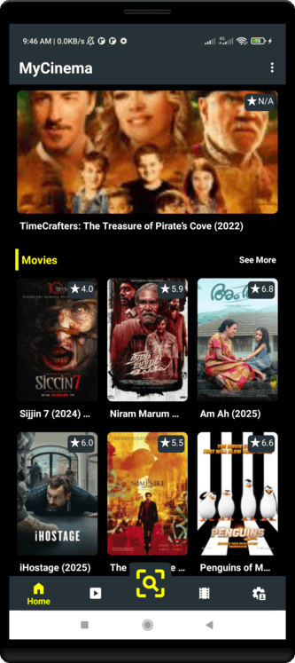
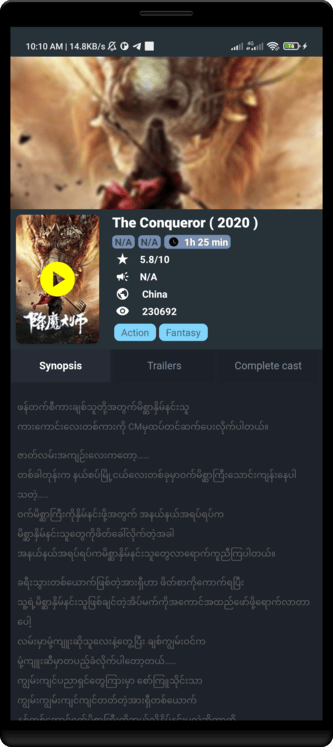
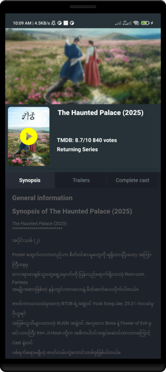

# MyCinema - Myanmar Movies & Series App

မြန်မာစာတန်းထိုး ရုပ်ရှင်၊ ဇာတ်လမ်းတွဲများကို ကြည့်ရှုရန်နှင့် ဒေါင်းလုတ်ဆွဲရန် Android Application

---

## 📱 ScreenShots

- - -

## 📱 အဓိက စွမ်းဆောင်ချက်များ

- **အခမဲ့ ကြည့်ရှုနိုင်ခြင်း**
    - မြန်မာစာတန်းထိုး ရုပ်ရှင်၊ ဇာတ်လမ်းတွဲများကို အလွယ်တကူ ကြည့်ရှုနိုင်ပါသည်။
- **ဒေါင်းလုတ်ဆွဲနိုင်ခြင်း**
    - Offline ကြည့်ရှုရန် ဒေါင်းလုတ်ဆွဲထားနိုင်ပါသည်။
- **နောက်ဆုံးထွက် Content များ**
    - Web Scraping နည်းဖြင့် Channel Myanmar နှင့် အခြား ဝက်ဘ်ဆိုဒ်များမှ နောက်ဆုံးထွက် ဇာတ်ကားများကို အလိုအလျောက် Update လုပ်ပေးပါသည်။
- **အမျိုးအစားခွဲခြား**
    - ဇာတ်ကား၊ ဇာတ်လမ်းတွဲ၊ ကာတွန်း၊ မြန်မာဇာတ်ကားများ အစရှိသဖြင့် Category အလိုက် ရှာဖွေနိုင်ပါသည်။
- **အမြန်ရှာဖွေရန်**
    - စိတ်ကြိုက် ဇာတ်ကားအမည်ဖြင့် Search Box မှ တိုက်ရိုက်ရှာဖွေနိုင်ပါသည်။
- **အသုံးပြုရလွယ်ကူသော UI**

    - Material Design ဖြင့် ရိုးရှင်းပြီး နားလည်လွယ်သော အင်တာဖေ့စ်။

- **ညဘက် Mode**
    - Dark Theme ဖြင့် ညဘက် ကြည့်ရှုရာတွင် မျက်စိအားပြန်မထိခိုက်စေရန်။

---

## 📥 လိုအပ်ချက်များ

- Android Version 7.0 (Lollipop) နှင့် အထက်
- Internet Connection (Wi-Fi/Mobile Data)
- Storage Permission (ဒေါင်းလုတ်ဆွဲရန်)

---

## ⚙️ ထည့်သွင်းအသုံးပြုနည်း

1. **APK File ဒေါင်းလုတ်ဆွဲပါ**  
   [Download Link](https://github.com/toewaioo/mycinema/releases/download/v1.5.0/app-release.apk) မှ APK ဖိုင်ကို ဒေါင်းလုတ်ဆွဲပါ။ (ဥပမာ - Google Drive, MediaFire)

2. **Unknown Sources ကို ခွင့်ပြုပါ**  
   `Settings > Security > Unknown Sources` တွင် Allow လုပ်ပါ။

3. **APK ကို Install လုပ်ပါ**  
   ဒေါင်းလုတ်ဆွဲထားသော APK ဖိုင်ကို နှိပ်၍ Install လုပ်ပါ။

4. **အက်ပ်ကို ဖွင့်ပါ**  
   Installation ပြီးလျှင် MyCinema အက်ပ်ကို စတင်အသုံးပြုနိုင်ပါပြီ။

---

## 🎥 အသုံးပြုနည်း

1. **ဇာတ်ကားရှာဖွေခြင်း**

    - Home Screen တွင် ကြော်ငြာထားသော ဇာတ်ကားများကို ရွေးချယ်ပါ။
    - Search Icon ကို နှိပ်၍ ဇာတ်ကားအမည်ရိုက်ထည့်ပါ။

2. **ဇာတ်ကားကြည့်ရှုခြင်း**

    - ဇာတ်ကားပုံစံကို နှိပ်ပါ။
    - Video Player ဖွင့်လာပါက Play Button ကို နှိပ်ပါ။

3. **ဒေါင်းလုတ်ဆွဲခြင်း**

    - ဇာတ်ကားစာမျက်နှာတွင် Download Button (⬇️) ကို နှိပ်ပါ။

4. **Watch Later စီမံခန့်ခွဲခြင်း**
    - `မီနူး > WatchLater` တွင် save ပြီးသော ဖိုင်များကို ကြည့်နိုင်ပါသည်။

---

## ❓ မေးလေ့ရှိသော မေးခွန်းများ (FAQ)

**Q: အက်ပ်ကို အခမဲ့ အသုံးပြုလို့ရပါသလား?**  
A: ဟုတ်ကဲ့၊ လုံးဝအခမဲ့ဖြစ်ပါသည်။

**Q: ဒေါင်းလုတ်ဆွဲရာတွင် အမြန်နှုန်း နှေးနေပါသည်။**  
A: သင့်၏ Internet Speed ပေါ်မူတည်ပါသည်။ Wi-Fi ဖြင့် ပြန်လည်စမ်းသပ်ပါ။

**Q: ဇာတ်ကားအသစ်များ ဘယ်လိုရှာမလဲ?**  
A: Home Screen ကို ဆွဲချပြီး Refresh လုပ်ပါက Auto Update ဖြစ်ပါမည်။

**Q: အက်ပ်က Update လုပ်ဖို့လိုအပ်ပါသလား?**  
A: နောက်ဆုံးထွက် Version ကို ကျွန်ုပ်တို့မှ ပုံမှန် Update လုပ်ပေးသွားပါမည်။

---

## ⚠️ သတိပြုရန်

- ဤအက်ပ်သည် **Channel Myanmar** အပါအဝင် Third-Party ဝက်ဘ်ဆိုဒ်များမှ Web Scraping နည်းဖြင့် ဒေတာများကို စုဆောင်းဖော်ပြပေးခြင်းသာဖြစ်ပြီး၊ ဖော်ပြထားသော ဇာတ်ကားများ၏ **မူပိုင်ခွင့် (Copyright)** သည် သက်ဆိုင်ရာ ထုတ်လုပ်ရေးစတူဒီယိုများ၊ ဖြန့်ချိရေးကုမ္ပဏီများတွင် အပြည့်အဝပိုင်ဆိုင်ပါသည်။
- ဤအက်ပ်ကို အသုံးပြုခြင်းဖြင့် ဖြစ်ပေါ်လာနိုင်သော မည်သည့် ဥပဒေရေးရာ၊ မူပိုင်ခွင့်ဆိုင်ရာ ပြဿနာများအတွက် **အက်ပ်ထုတ်လုပ်သူ (Developer) မှ တာဝန်မယူပါ**။
- ဇာတ်ကားများကို ဒေါင်းလုတ်ဆွဲခြင်း၊ ပြန်လည်ဖြန့်ဝေခြင်းသည် မူပိုင်ခွင့်ဥပဒေနှင့် ဆန့်ကျင်နိုင်သည်ကို သိရှိပြီး အသုံးပြုသူများကိုယ်တိုင် တာဝန်ခံရမည်ဖြစ်ပါသည်။
- ဤအက်ပ်ကို ပညာရပ်ဆိုင်ရာ လေ့လာမှုနှင့် ကိုယ်ပိုင်အသုံးပြုရန် ရည်ရွယ်ပါသည်။ ဥပဒေနှင့်မညီညွတ်သော အသုံးပြုမှုများကို လုံးဝမထောက်ခံပါ။

---

## 📞 ဆက်သွယ်ရန်

အကူအညီလိုအပ်ပါက အောက်ပါဆက်သွယ်ရန် လိပ်စာများသို့ ဆက်သွယ်နိုင်ပါသည်။

- Email: [support@mycinema.com](mailto:support.mycinema@gmail.com)
- Facebook Page: [MyCinemaMM](https://facebook.com/liarkod)
- Telegram Channel: [@MyCinema_Updates](https://t.me/mycinema_app)